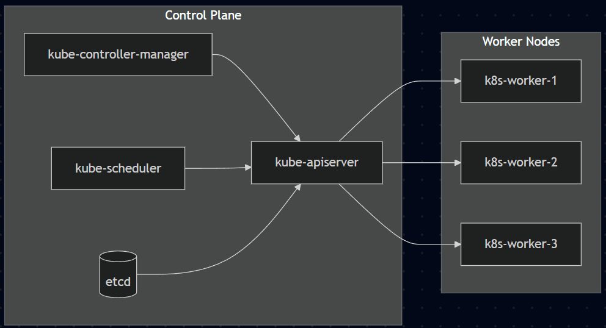

🧪 LAB 01 — Kubernetes Cluster Setup & Validation
📌 Overview

This lab demonstrates how to build a production-grade Kubernetes cluster using kubeadm, validate networking, confirm node health, and verify core system components.

It forms the foundation lab for all subsequent Kubernetes workloads, networking, security, and application deployments in this repository.

## 📌 Objective
Build a production-style Kubernetes home lab using `kubeadm`, validate cluster health, and verify networking using Calico CNI.

This lab establishes the **foundation for all subsequent Kubernetes labs** in this repository.

---

## 🏗️ Cluster Architecture

<p align="center">
  
</p>

**Architecture Overview**
- 1 × Control Plane (Master)
- 3 × Worker Nodes
- Container Runtime: containerd
- Networking: Calico CNI
- Environment: Ubuntu (WSL / VirtualBox-based Home Lab)

Role	Hostname	Example IP
Control Plane	k8s-master	192.168.56.10
Worker Node	k8s-worker-1	192.168.56.11
Worker Node	k8s-worker-2	192.168.56.12
Worker Node	k8s-worker-3	192.168.56.13

Note: IPs shown are host-only network examples. Your environment may differ.

⚙️ Environment & Tooling

OS: Ubuntu Linux

Container Runtime: containerd

Kubernetes Version: v1.30

Networking: Calico CNI

Bootstrap Tool: kubeadm

## 🔁 Cluster Bootstrap Flow (kubeadm)

<p align="center">
  
</p>

**Bootstrap Steps**
1. Initialize control plane using `kubeadm init`
2. Configure kubeconfig for cluster access
3. Deploy Calico CNI
4. Join worker nodes using `kubeadm join`
5. Verify node readiness


🧩 Implementation Steps
A️⃣ Pre-Checks (ALL Nodes)
1. Set Hostnames
sudo hostnamectl set-hostname k8s-master
# or k8s-worker-1 / k8s-worker-2 / k8s-worker-3

2. Update /etc/hosts
sudo nano /etc/hosts

192.168.56.10 k8s-master
192.168.56.11 k8s-worker-1
192.168.56.12 k8s-worker-2
192.168.56.13 k8s-worker-3

3. Disable Swap
sudo swapoff -a
sudo sed -i '/ swap / s/^/#/' /etc/fstab

4. Enable Kernel Modules & Sysctl
cat <<EOF | sudo tee /etc/modules-load.d/k8s.conf
overlay
br_netfilter
EOF

sudo modprobe overlay
sudo modprobe br_netfilter

cat <<EOF | sudo tee /etc/sysctl.d/k8s.conf
net.bridge.bridge-nf-call-iptables = 1
net.bridge.bridge-nf-call-ip6tables = 1
net.ipv4.ip_forward = 1
EOF

sudo sysctl --system

B️⃣ Install Container Runtime — containerd (ALL Nodes)
sudo apt-get update
sudo apt-get install -y containerd

sudo mkdir -p /etc/containerd
containerd config default | sudo tee /etc/containerd/config.toml > /dev/null
sudo sed -i 's/SystemdCgroup = false/SystemdCgroup = true/' /etc/containerd/config.toml

sudo systemctl restart containerd
sudo systemctl enable containerd
systemctl status containerd --no-pager

C️⃣ Install Kubernetes Components (ALL Nodes)
sudo apt-get update
sudo apt-get install -y apt-transport-https ca-certificates curl gpg

sudo mkdir -p /etc/apt/keyrings
curl -fsSL https://pkgs.k8s.io/core:/stable:/v1.30/deb/Release.key | \
sudo gpg --dearmor -o /etc/apt/keyrings/kubernetes-apt-keyring.gpg

echo "deb [signed-by=/etc/apt/keyrings/kubernetes-apt-keyring.gpg] \
https://pkgs.k8s.io/core:/stable:/v1.30/deb/ /" | \
sudo tee /etc/apt/sources.list.d/kubernetes.list

sudo apt-get update
sudo apt-get install -y kubelet kubeadm kubectl
sudo apt-mark hold kubelet kubeadm kubectl
sudo systemctl enable kubelet

D️⃣ Initialize the Cluster (MASTER Only)
sudo kubeadm init \
  --apiserver-advertise-address=192.168.56.10 \
  --pod-network-cidr=192.168.0.0/16

Configure kubectl
mkdir -p $HOME/.kube
sudo cp /etc/kubernetes/admin.conf $HOME/.kube/config
sudo chown $(id -u):$(id -g) $HOME/.kube/config

kubectl get nodes
kubectl get pods -A


NotReady is expected until CNI is installed.

## 🌐 Pod Networking (Calico CNI)

<p align="center">
  
</p>

**Networking Highlights**
- Each Pod receives a unique IP
- Calico enables pod-to-pod communication across nodes
- Network policies enforced at Layer 3/4
- Scalable and production-grade CNI solution

E️⃣ Install Calico CNI (MASTER Only)
kubectl apply -f https://raw.githubusercontent.com/projectcalico/calico/v3.28.0/manifests/calico.yaml

kubectl get pods -n kube-system -w
kubectl get nodes -o wide

F️⃣ Join Worker Nodes
On Master
sudo kubeadm token create --print-join-command

On Each Worker
sudo kubeadm join <MASTER-IP>:6443 --token <TOKEN> \
--discovery-token-ca-cert-hash sha256:<HASH>

G️⃣ Final Validation (MASTER Only)
kubectl get nodes -o wide
kubectl get pods -A
kubectl get pods -n kube-system | grep coredns

## ✅ Cluster Validation & Health Checks

<p align="center">
  
</p>

**Validation Checklist**
- [x] Control plane initialized successfully
- [x] All worker nodes joined
- [x] Nodes in `Ready` state
- [x] Core system pods running
- [x] DNS resolution functional
- [x] Pod networking verified


DNS Verification
kubectl run dns-test --image=busybox:1.36 -it --rm --restart=Never -- \
nslookup kubernetes.default

✅ Completion Checklist

 All 4 nodes in Ready state

 No CrashLoopBackOff pods

 Calico pods running

 CoreDNS pods running

 DNS resolution successful

🛠 Troubleshooting & Recovery
Workers Stuck NotReady
kubectl -n kube-system get pods


Reapply Calico if required.

Join Token Expired
sudo kubeadm token create --print-join-command

Full Cluster Reset (ALL Nodes)
sudo kubeadm reset -f
sudo rm -rf ~/.kube
sudo systemctl restart containerd kubelet

## 🧪 Commands Used

```bash
kubeadm init
kubectl get nodes
kubectl get pods -A
kubectl describe node
kubectl cluster-info

📘 Lab Status

Status: ✅ Completed
Next Lab: LAB 02 — Kubernetes Namespaces & Pod Operations
